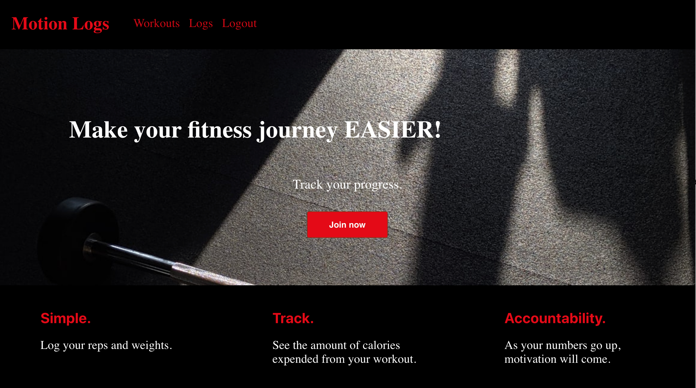
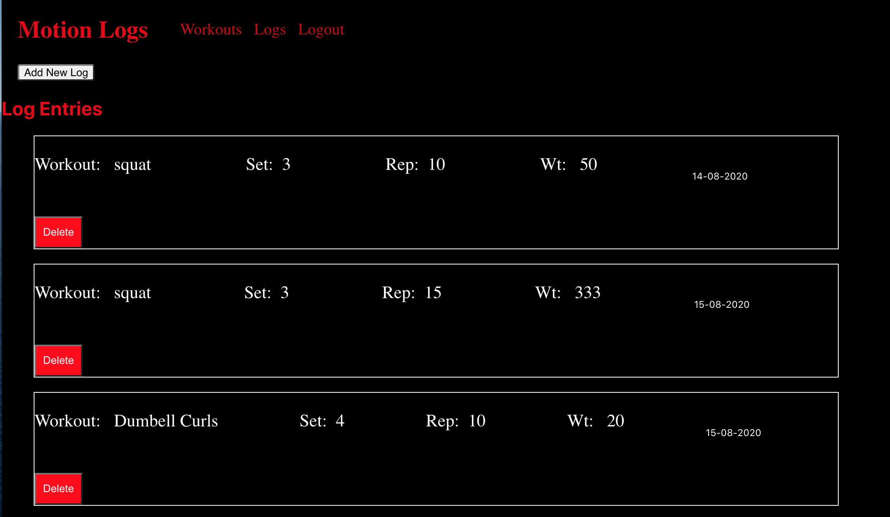
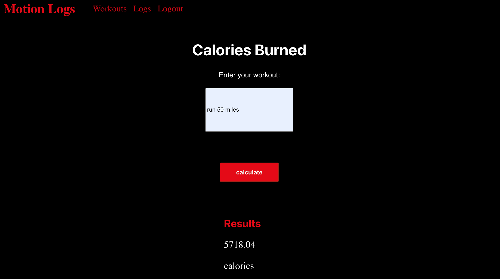
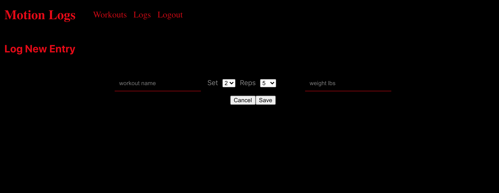

Motion Logs Server
================
* * *

Summary
-------
This is an application to help you achieve your fitness goals. 
It logs workouts by rep, sets, and weights while providing a search engine to look up calories expended.

Demo
----
* * *

[Demo](https://motionlogs-app.vercel.app)  
[Repo](https://github.com/jennantran/motionLogs-api) 
[Client Repo](https://github.com/jennantran/motionlogs-app) 

Demo user account:  
username: jennantran  
password: password1
* * *

Getting Started
---------------
1. Clone the server repository to your local machine: 
2. Cd into the new cloned repository
3. Install the node dependencies using npm install
4. Update the .env file with PORT, DATABASE_URL, TEST_DATABASE_URL, JWT_SECRET, and API_TOKEN
5. Run migration using: npm run migrate
6. Run the sql scripts and seed files on Postgres database

Scripts
-----------
To start the application: npm run dev
To run migrations: npm run migrate
Run the tests: npm run test

API Documentation
-------
GET /api/logs
DELETE /api/logs/:log_id
POST /api/logs/:log_id

GET api/users
POST api/users

Screenshots
-----------
Homepage:

Logs Page:

Workout Page:

Add Log Form:

* * *

Technologies Used
-----------------
1. Chai, Mocha
2. JWT
3. Node
4. Express
